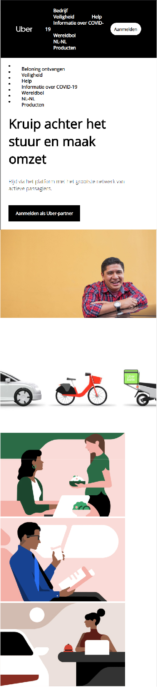
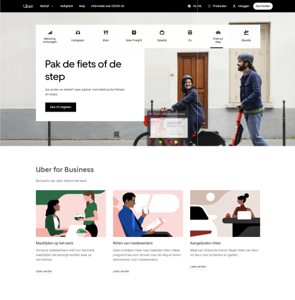

# Procesverslag
**Auteur:** Joël Jansen

Markdown cheat cheet: [Hulp bij het schrijven van Markdown](https://github.com/adam-p/markdown-here/wiki/Markdown-Cheatsheet). Nb. de standaardstructuur en de spartaanse opmaak zijn helemaal prima. Het gaat om de inhoud van je procesverslag. Besteedt de tijd voor pracht en praal aan je website.

## Bronnenlijst
1. -bron 1-
2. -bron 2-
3. -...-

## Eindgesprek (week 7/8)

-dit ging goed & dit was lastig-

**Screenshot(s):**

-screenshot(s) van je eindresultaat-

## Voortgang 3 (week 6)

-same as voortgang 1-

## Voortgang 2 (week 5)

-same as voortgang 1-

## Voortgang 1 (week 3)

### Stand van zaken

-Ik ben begonnen met de home-page en merk dat ik het positioneren nog erg lastig vind. Wat in de oefeningen goed ging, verloopt nu nog stroef. Daarnaast gaat mijn tempo met de opmaak van onderdelen beter. Buttons, hoovers, letter grootte en kleur gaat zo goed als vanzelf. Er valt nog niet heel veel over te zeggen en het is momenteel veel trial and error. Ik ga dit weekend er veel tijd in stoppen om de bovengenoemde struggles boven te komen en als dat niet lukt toch hulp te vragen. -

**Screenshot(s):**

### Agenda voor meeting

-Volgende week eerste draft van volledige pagina 1 af (mobile) -

### Verslag van meeting

-na afloop snel uitkomsten vastleggen-

## Intake (week 1)

**Je startniveau:** -kies uit zwart, rood óf blauw-

- Mijn startniveau is ROOD -

**Je focus:** -kies uit responsive óf surface plane-

- Extra aandacht voor de SURFACE laag -

**Je opdracht:** -link naar de website die je gaat namaken óf de naam van je eigen ontwerp-

- https://www.uber.com/nl/nl/ -

**Screenshot(s):**

**Breakdown-schets(en):**

