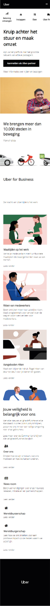
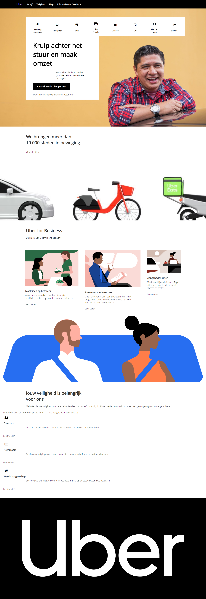
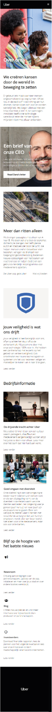
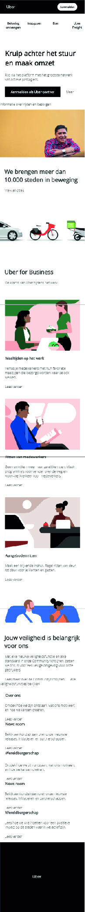

Link naar site:
https://joelkenneth.github.io/project.web.jj/

# Procesverslag
**Auteur:** Joël Jansen

Markdown cheat cheet: [Hulp bij het schrijven van Markdown](https://github.com/adam-p/markdown-here/wiki/Markdown-Cheatsheet). Nb. de standaardstructuur en de spartaanse opmaak zijn helemaal prima. Het gaat om de inhoud van je procesverslag. Besteedt de tijd voor pracht en praal aan je website.

## Bronnenlijst
1. -navigation bar | https://codepen.io/WebDevSimplified/pen/LqKQRK-
2. -bron 2-
3. -...-

## Herkansing (week 9)

De versie tijdens het vorige gesprek was niet af, dus moest ik voor een herkansing gaan. En nu vind ik wel dat mijn site af is. Tuurlijk kan je nog door blijven tweaken totdat alles 100% is, maar dan heb je ook nog meer weken nodig. Ik heb tijdens het maken van de herkansing echt stappen gemaakt, niet alleen in mijn site maar ook het coderen. Het responsive maken (voor 2 schermgroottes) is goed gelukt naar mijn idee. Door middel van flexbox veranderen kolommen van een 1 koloms (mobile) op het juist moment naar 2 of 3 kolommen. Naast het afmaken heb ik ook alle feedback verwerkt als geen "#" meer bij href's, geen 0em etc., alle id's verandert naar classes behalve op de hele specifieke id's na dan, ik heb font awesome vervangen door gebruik te maken van svg'tjes, veel div's verandert in article om het positioneren te vereenvoudigen en de vh's verwijdert uit de css en consistent gebleven in het gebruik van em. Het enige wat jammer is, is dat ergens in het proces mijn dropdown menu in de navbar gecrasht is. Doordat ik wat tips had gekregen om elementen in mijn navbar te positioneren werkt die niet meer. Over het algemeen ben ik nu dik tevreden met mijn resultaat. Als ik op een gegeven moment zonder iets op te zoeken een articles in een sections kader en display flex + order er op gooi en alles staat ineens kaarsrecht, dan is dat een dikke win. Aan het begin van dit blok gebruikte px voor alles groottes, dus ik ben van ver gekomen.

## Eindgesprek (week 7/8)

-dit ging goed & dit was lastig-
Mijn time management was bij het laatste deel heel matig. De inschatting van hoeveel tijd ik dacht nodig te hebben om de SURFACE laag extra aandacht te geven was te weinig. Heel veel kleine elementen er in krijgen kostte veel tijd en baal ik van dat ik het daardoor niet af heb weten te krijgen voor nu. Dit was ook een eerste keer media queries voor mij en dat viel ook tegen. Daarnaast heb ik voor mijn gevoel ook een lastige website gekozen met veel veranderende en verplaatsende elementen en ee website waarbij de code er achter niet bruikbaar is, dus zelf alles moet uitvinden. Dit is wel leuk en goed om code beter te leren, maar heeft veel invloed gehad op mijn proces. Tot zover heb ik de mobiele versie van 2 pagina's zo goed als af, de punten die nog missen zijn: de navigation bar is niet compleet, wat micro interacties missen hier en daar en de footer is niet af. Voor de web versie van home page ben ik een heel eind, maar voor de "Over ons" pagina mist nog een hoop. Verder ging positioneren van elementen op de pagina steeds beter (ook met flexbox, wat ik tot deze week nooit echt heb gesnapt), is het visuele opmaak van tekst etc. wel steady en heb ik wel echt gestreden voor mijn gevoel. Ik ben echt een vormgever en code was echt niet mijn ding, maar als ik zie hoeveel progressie ik maak in het proces ben ik daar wel positief over. Met dit beoordelingsgepsrek hoop ik een aantal hobbels te overbruggen en het bij de herkansing (daar ga ik van uit nu) dit wel te behalen. 

**Screenshot(s):**
 
 
-screenshot(s) van je eindresultaat-

## Voortgang 3 (week 6)

-Na een dipje heb ik wel wat stappen gemaakt, maar er zijn er nog veel te gaan. Ik heb nu 2 pages voor mobiel zo goed als af, alleen nog de code meer semantisch maken en laatste details tweaken. Alleen met mijn header loop ik nog te struggelen, dus daar zal ik hulp bij zoeken. De uitdaging wordt nu om in de vakantie de pagina's responsive te maken en de vormgeving volledig gedetailleerd te maken met bijv. animaties en micro-interacties. 

## Voortgang 2 (week 5)

-Er zit veel vooruitgang in. De home pagina voor mobile staat voor mijn gevoel bijna klaar. Nog wel veel tweaken met ruimtes en groottes. Ik merk dat ik daar ook de meeste moeite mee heb en de benamingen van onderdelen zonder bijv. een class te gebruiken. De carroussel zit er ook in onder de header na veel moeite, maar er moet nog wel qua usability wat verandingen.-

## Voortgang 1 (week 3)

### Stand van zaken

-Ik ben begonnen met de home-page en merk dat ik het positioneren nog erg lastig vind. Wat in de oefeningen goed ging, verloopt nu nog stroef. Daarnaast gaat mijn tempo met de opmaak van onderdelen beter. Buttons, hoovers, letter grootte en kleur gaat zo goed als vanzelf. Er valt nog niet heel veel over te zeggen en het is momenteel veel trial and error. Ik ga dit weekend er veel tijd in stoppen om de bovengenoemde struggles boven te komen en als dat niet lukt toch hulp te vragen. -

**Screenshot(s):**

### Agenda voor meeting

-Volgende week eerste draft van volledige pagina 1 af (mobile) -

### Verslag van meeting

-na afloop snel uitkomsten vastleggen-

## Intake (week 1)

**Je startniveau:** -kies uit zwart, rood óf blauw-

- Mijn startniveau is ROOD -

**Je focus:** -kies uit responsive óf surface plane-

- Extra aandacht voor de SURFACE laag -

**Je opdracht:** -link naar de website die je gaat namaken óf de naam van je eigen ontwerp-

- https://www.uber.com/nl/nl/ -

**Screenshot(s):**

**Breakdown-schets(en):**

